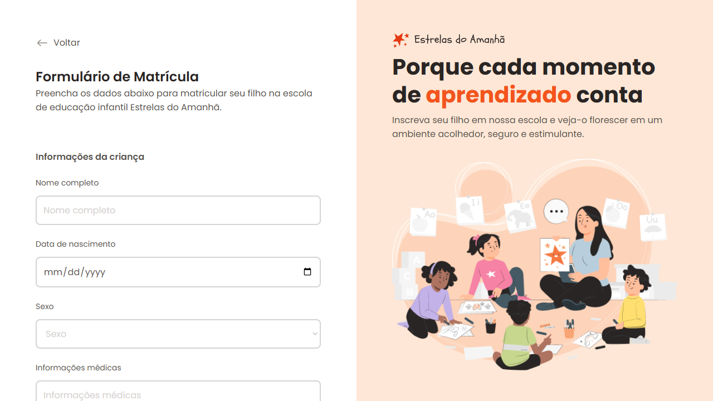
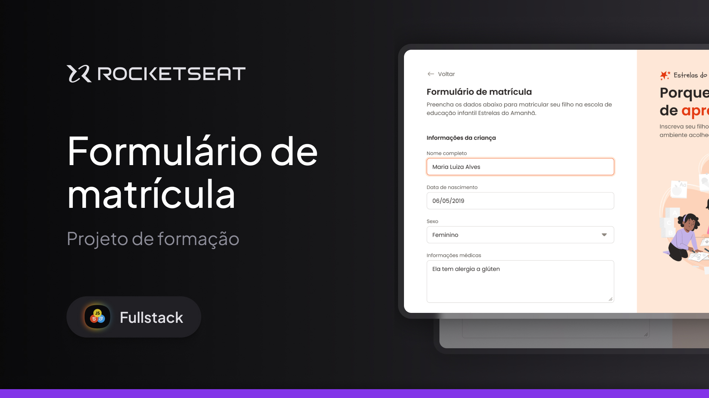

<h1 align="center">
  
</h1>

<div align="center">
  <a href="#📸-visão-do-projeto--project-view">📸 Visão do Projeto | Project View</a> -
  <a href="#ℹ-sobre-o-projeto--about-the-project">ℹ Sobre o Projeto | About the Project</a> -
  <a href="#🏗-principais-funcionalidades--main-features">🏗 Principais Funcionalidades | Main Features</a> -
  <a href="#⚙️-tecnologias--technologies">⚙️ Tecnologias | Technologies</a> -
  <a href="#🧪-testar-o-projeto---clique-no-botão--test-the-project---click-on-the-button">🧪 Testar o Projeto - Clique no botão | Test the Project - Click on the button</a> -
  <a href="#🎨-layout---clique-na-miniatura--layout---click-on-the-thumbnail">🎨 Layout - Clique na miniatura | Layout - Click on the thumbnail</a> -
  <a href="#💻-clonagem-do-repositório--repository-cloning">💻 Clonagem do Repositório | Repository Cloning</a> -
  <a href="#🤝-contribuições--contributions">🤝 Contribuições | Contributions</a> -
  <a href="#👨‍💻-autor--author">👨‍💻 Autor | Author</a>
</div>

## 📸 Visão do Projeto | Project View

<div align="center">
  
  

</div>

## ℹ Sobre o Projeto | About the Project

### 🌐 Português

Esse projeto foi um mockup desenvolvido para aprendizado no seu curso da Rocketseat. O foco principal foi a criação de um formulário de matrícula para a escola de educação infantil Estrelas do Amanhã. O desafio envolvia a construção de uma interface de usuário funcional, mas de caráter puramente visual e conceitual, sem integração com banco de dados ou backend.

A abordagem adotada no projeto envolveu o uso de HTML, CSS e algumas estratégias para aprimorar a experiência do usuário, como layouts e interação visual utilizando hover effects e estados de foco. Os estilos foram estruturados de forma modular, com estilizações reutilizáveis para os diferentes tipos de input, como campos de texto, checkboxes, radio buttons e upload de arquivos. Esse design modular, além de facilitar a manutenção do código, possibilitou uma experiência de usuário mais fluida e intuitiva.

O projeto também incluiu práticas de acessibilidade, como o uso de labels para inputs e a implementação de estados de foco visíveis, garantindo que a interface fosse usável para diferentes tipos de usuários. A utilização de variáveis CSS e a adoção de uma paleta de cores coesa ajudaram a criar uma estética agradável e funcional.

Como resultado, o projeto proporcionou um melhor entendimento sobre práticas de design de formulários e como organizar e modularizar o código front-end. Além disso, contribuiu para o aprimoramento das habilidades de CSS, manipulação de layout e interação com o usuário, sendo uma base sólida para futuros projetos mais complexos.

### 🌐 English

This project was a mockup developed for learning purposes in the Rocketseat course. The main focus was the creation of a registration form for the Estrelas do Amanhã early childhood education school. The challenge involved building a functional user interface, but with a purely visual and conceptual nature, without integration with a database or backend.

The approach taken in the project involved the use of HTML, CSS, and strategies to enhance the user experience, such as layouts and visual interaction through hover effects and focus states. The styles were structured modularly, with reusable stylizations for different types of inputs, such as text fields, checkboxes, radio buttons, and file uploads. This modular design not only facilitated code maintenance but also allowed for a smoother and more intuitive user experience.

The project also included accessibility practices, such as using labels for inputs and implementing visible focus states, ensuring the interface was usable for different types of users. The use of CSS variables and the adoption of a cohesive color palette helped create a visually pleasing and functional aesthetic.

As a result, the project provided a better understanding of form design practices and how to organize and modularize front-end code. It also contributed to enhancing skills in CSS, layout manipulation, and user interaction, serving as a solid foundation for more complex future projects.

## 🏗 Principais Funcionalidades | Main Features

### 🌐 Português

- [x] **Campos de entrada de texto com validação visual:** Coleta de dados como nome do aluno, data de nascimento e informações dos responsáveis, com estrutura clara e indicações visuais que orientam o preenchimento correto.

- [x] **Checkboxes e radio buttons customizados:** Opções visuais para seleção de modalidades de pagamento e preferências de horário, com ícones interativos e efeitos de estado (`:hover`, `:checked`).

- [x] **Upload de arquivos com ícone dinâmico:** Campo estilizado para envio de documentos obrigatórios, como certidão de nascimento ou comprovante de residência, com feedback visual ao interagir.

- [x] **Interação visual e feedback nos componentes:** Respostas visuais consistentes nos elementos de formulário ao focar, passar o mouse ou selecionar opções, reforçando a experiência do usuário.

- [x] **Design modular com CSS organizado por componentes:** Estrutura de estilos separada por responsabilidade (`input-checkbox.css`, `input-radio.css`, `input-file.css`, etc.), facilitando manutenção e escalabilidade.

- [x] **Uso de variáveis CSS para identidade visual:** Cores e espaçamentos padronizados via variáveis no `:root`, garantindo consistência e facilidade de ajustes visuais.


### 🌐 English

- [x] **Text input fields with visual validation:** Collects data such as the student's name, birth date, and guardian information, with clear structure and visual cues to guide correct form completion.

- [x] **Custom checkboxes and radio buttons:** Visual selection options for payment methods and schedule preferences, with interactive icons and state-based effects (`:hover`, `:checked`).

- [x] **File upload with dynamic icon feedback:** Styled input field for uploading required documents like birth certificate or proof of residence, providing visual feedback during interaction.

- [x] **Interactive UI with visual feedback on components:** Consistent visual responses for form elements on focus, hover, and selection states, enhancing user experience.

- [x] **Modular design with component-based CSS:** Styles are organized by responsibility (`input-checkbox.css`, `input-radio.css`, `input-file.css`, etc.), improving maintainability and scalability.

- [x] **CSS variables for consistent visual identity:** Colors and spacing standardized through `:root` variables, ensuring a cohesive design and simplifying future changes.


## ⚙️ Tecnologias | Technologies

- <a href="https://www.w3schools.com/html/default.asp"> HTML</a>
- <a href="https://www.w3schools.com/css/"> CSS</a>

## 🧪 Testar o Projeto - Clique no botão | Test the Project - Click on the button

<a href="https://henry-frrz.github.io/stars-tomorrow/">
  
</a>

## 🎨 Layout - Clique na miniatura | Layout - Click on the thumbnail

<a align="center" href="https://www.figma.com/community/file/1365016793556649696/formulario-de-matricula">
  
</a>

## 💻 Clonagem do Repositório | Repository Cloning

### 🌐 Português

1. **Requisitos:** Você precisa apenas de um navegador para executar este projeto.

2. **Baixar o Projeto:** Clique no botão **Code** e selecione **Download ZIP**, depois extraia os arquivos no local desejado. Alternativamente, você pode clonar o repositório usando Git:

```bash
git clone https://github.com/henry-frrz/stars-tomorrow.git
```

3. **Abrir o Projeto:** Localize os arquivos extraídos ou clonados e abra o arquivo `index.html` no seu navegador.

### 🌐 English

1. **Requirements:** You only need a web browser to run this project.

2. **Download the Project:** Click on the **Code** button and select **Download ZIP**, then extract the files to your preferred location. Alternatively, you can clone the repository using Git:

```bash
git clone https://github.com/henry-frrz/stars-tomorrow.git
```

3. **Open the Project:** Locate the extracted or cloned files and open the index.html file in your browser.

## 🤝 Contribuições | Contributions

### 🌐 Português

Se você deseja contribuir para o projeto, siga as diretrizes abaixo:

1. Faça um fork do repositório no GitHub.

2. Crie uma nova branch para sua contribuição:

```bash
git checkout -b feature/sua-contribuicao
```

3. Faça as alterações necessárias e teste para garantir que as mudanças sejam robustas e confiáveis.

4. Envie suas alterações com um pull request (PR).

5. Após revisão e aprovação, suas alterações serão incorporadas ao projeto.

### 🌐 English

If you would like to contribute to the project, please follow the contribution guidelines below:

1. Fork the repository on GitHub.

2. Create a new branch for your contribution:

```bash
git checkout -b feature/your-contribution
```

3. Make any necessary changes, and test them to ensure that the changes are robust and reliable.

4. Submit your changes with a pull request (PR).

5. After review and approval, your changes will be incorporated into the project.

## 👨‍💻 Autor | Author

<a href="https://github.com/henry-frrz">

</a>
<br>
